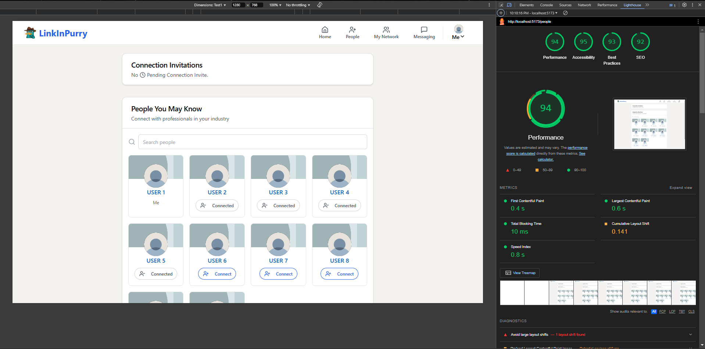

<!-- Back to Top Link-->

<a name="readme-top"></a>

<br />
<div align="center">
  <h1 align="center">LinkInPurry</h1>

  <p align="center">
    <h3>Social Media Platform to help agents find job opportunities</h3>
    <h4>Single Page Web Application</h4>
    <h4>FE using React, Tailwind, Typescript, Vite</h4>
    <h4>BE using Express, Prisma, PostgreSQL</h4>
    <br/>
  </p>
</div>

<!-- CONTRIBUTOR -->
<div align="center" id="contributor">
  <strong>
    <h3>Made By:</h3>
    <h3>K02-13</h3>
    <table align="center">
      <tr>
        <td>NIM</td>
        <td>Name</td>
      </tr>
      <tr>
        <td>13521026</td>
        <td>Kartini Copa</td>
      </tr>
      <tr>
        <td>13522091</td>
        <td>Raden Francisco Trianto B</td>
      </tr>
      <tr>
        <td>13522115</td>
        <td>Derwin Rustanly</td>
      </tr>
    </table>
  </strong>
  <br>
</div>

## External Links

- [Specification](https://docs.google.com/document/d/13HgcoKLBYXAIrXfLJcDr-rA86W9lM95FrYj1TJc3eM4/edit?tab=t.0#heading=h.2jtt06fg4xjm)
- [QNA](https://docs.google.com/spreadsheets/d/1G_0Llod1uE1i4zkekeghTgKJtYP7UuFmbkLBxZv4iK8/edit?gid=87638913#gid=87638913)
- [Team List](https://docs.google.com/spreadsheets/d/19nHs-DBLVtkjZjwfnYwfaAKBtWhLVv6J/edit?gid=1905125303#gid=1905125303)

<p align="right">(<a href="#readme-top">back to top</a>)</p>

<!-- TABLE OF CONTENTS -->

## Table of Contents

- [External Links](#external-links)
- [Table of Contents](#table-of-contents)
- [About The Project](#about-the-project)
- [Getting Started](#getting-started)
  - [Prerequisites](#prerequisites)
    - [Frontend](#frontend)
    - [Backend](#backend)
  - [Installation](#installation)
- [Instruction](#instruction)
- [Features](#features)
  - [Pages](#pages)
  - [Bonus](#bonus)
- [Task Distribution](#task-distribution)
  - [Server side](#server-side)
  - [Client Side](#client-side)
  - [Other and Bonus](#other-and-bonus)
- [Contributing](#contributing)
- [Google Lightouse](#google-lightouse)
- [API Documentation](#api-documentation)

<!-- ABOUT THE PROJECT -->

## About The Project

LinkInPurry is Social Media Platform to help agents find job opportunities, inspired by the iconic Purry the Platypus. This web application aims to connect agents with exciting job opportunities, making the job networking process efficient and straightforward.

<p align="right">(<a href="#readme-top">back to top</a>)</p>

<!-- GETTING STARTED -->

## Getting Started

### Prerequisites

Project dependencies

- Docker
- Node

#### Frontend

- Vite React
- Tailwind
- Shadcn
- React Router DOM

#### Backend

- ExpressJs
- PostgreSQL

<p align="right">(<a href="#readme-top">back to top</a>)</p>

### Installation

_How to install and use your project_

1. Clone the repo
   ```sh
   git clone https://github.com/Labpro-21/if-3310-2024-2-k02-13
   ```
2. Change directory
   ```sh
   cd if-3310-2024-2-k02-13
   ```
3. Start the application using Docker

   ```sh
   # build the application using Docker
   docker compose up -d --build
   ```

4. Open the web application

   ```sh
   # FRONTEND:
   http://localhost:5173/

   # BACKEND:
   http://localhost:3000/
   ```

<p align="right">(<a href="#readme-top">back to top</a>)</p>

<!-- INSTURCTION -->

## Instruction

Instruction to run/build the program

**Using Docker:**

`docker compose up` : to run the program using docker

`docker compose up -d --build` : to build and run the program using docker

`http://localhost:5173/` : The website Frontend hosted on localhost
`http://localhost:3000/` : The website Backend hosted on localhost

<p align="right">(<a href="#readme-top">back to top</a>)</p>

<!-- FEATURES -->

## Features

### Pages

1. Login
2. Register
3. Feed
4. Profile
5. People (User List + Invitation)
6. Chat (messanging)
7. Network (Connection List)

### Bonus

1. UI/UX like Linkendin
2. Caching
3. Typing
4. Google Lighthouse, [check it here](#google-lightouse)
5. Connection Recommmendation

<p align="right">(<a href="#readme-top">back to top</a>)</p>

## Task Distribution

### Server side

| No  |     Page/Feature     |         By         |
| :-: | :------------------: | :----------------: |
|  1  | Setup Docker and BE  |      13522115      |
|  2  |    Authentication    |      13522115      |
|  3  |       Profile        | 13522115, 13522091 |
|  4  |      Connection      |      13522115      |
|  5  |         Feed         | 13521026, 13522115 |
|  6  |  Chat and Websocket  |      13522115      |
|  7  |     Notification     |      13522115      |
|  8  | Stress and Load Test |      13522115      |

### Client Side

| No  |  Page/Feature   |              By              |
| :-: | :-------------: | :--------------------------: |
|  1  |    Setup FE     |           13522091           |
|  2  |      Login      |      13521026, 13522091      |
|  3  |    Register     |      13521026, 13522091      |
|  4  |     Profile     |      13522091, 13522115      |
|  5  |      Feed       |      13522091, 13522115      |
|  6  | Connection List |      13521026, 13522091      |
|  7  |   Invitation    |      13521026, 13522091      |
|  8  |    User List    |      13521026, 13522091      |
|  9  |      Chat       | 13521026, 13522115, 13522091 |

### Other and Bonus

| No  |       Feature                 |              By              |
| :-: | :---------------------------: |  :--------------------------: |
|  1  |        README                 |           13522091           |
|  2  | UI/UX like Linkendin          | 13521026, 13522091, 13522115 |
|  3  |       Caching                 |           13522115           |
|  4  |        Typing                 |           13522115           |
|  5  |  Google Lighthouse            |           13522091           |
|  6  |  Connection Recommmendation   |           13522115           |
|  7  |  API Documentation            |           13522115           |

<p align="right">(<a href="#readme-top">back to top</a>)</p>

<!-- CONTRIBUTING -->

## Contributing

If you want to contribute or further develop the program, please fork this repository using the branch feature.

Pull Request is **permited and warmly welcomed**

<p align="right">(<a href="#readme-top">back to top</a>)</p>

<!-- SPECIAL THANKS AND/OR CREDITS -->

<br>
<h3 align="center"> THANK YOU! </h3>

<!-- Repository: https://github.com/Labpro-21/if-3310-2024-2-k02-13 -->

<br>
<br>
<br>

## Google Lightouse

**_NOTE: Some Styling in screenshot is ruined due to vite react preview. But this does not effect the result for the google lighthouse_**

1. Login
   

2. Register
   

3. Feed
   

4. Profile
   

5. People (User List + Invitation)
   

6. Chat (messanging)
   

7. Network (Connection List)
   

## API Documentation
- [Postman Link](https://www.postman.com/crimson-zodiac-513368/workspace/wbd-linkinpurry-k02-13)

## Load Tests
- 
- 
- 
- 

